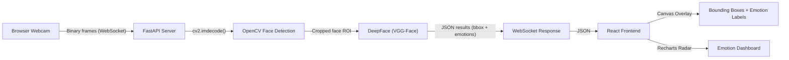

# EmotiSense AI

A real-time Facial Emotion Recognition (FER) web application built with FastAPI, React (Vite), OpenCV, and DeepFace.

  

## Overview

This project implements an end-to-end Computer Vision pipeline for detecting faces and classifying their emotional state in real-time via a web browser. 

The system leverages a client-server architecture:
1. **Frontend**: Captures webcam frames using the HTML5 `<video>` and Canvas APIs, and streams binary JPEG frames to the backend.
2. **Backend**: Processes incoming frames over WebSockets. Uses OpenCV's Haar Cascade for rapid face localization, followed by DeepFace (a deep learning facial recognition framework) to classify emotions into 7 categories.
3. **Dashboard**: Receives real-time JSON responses and overlays bounding boxes and emotion probabilities on a sleek, sci-fi themed UI built with Tailwind CSS and Framer Motion.

## Features

- **Real-Time Streaming**: Low-latency WebSocket communication.
- **Robust Face Detection**: Utilizes OpenCV for fast and reliable face cropping.
- **Deep Learning Inference**: Powered by the pre-trained `VGG-Face` model via the `deepface` library.
- **Modern Cyberpunk UI**: Built with React, Tailwind CSS v3, and Framer Motion.
- **Interactive Data Visualization**: Real-time Recharts Radar Chart and animated progress bars.

## Architecture



## Setup & Installation

### Prerequisites
- Python 3.9+
- Node.js 18+
- Webcam

### Backend Setup

1. Navigate to the backend directory:
   ```bash
   cd backend
   ```
2. Create and activate a virtual environment:
   ```bash
   python -m venv venv
   # Windows
   .\venv\Scripts\activate
   # macOS/Linux
   source venv/bin/activate
   ```
3. Install dependencies:
   ```bash
   pip install -r requirements.txt
   ```
   > **Note:** The first time you run the backend, DeepFace will automatically download the pre-trained model weights (~6MB for the emotion model).

### Frontend Setup

1. Navigate to the frontend directory:
   ```bash
   cd frontend
   ```
2. Install Node modules:
   ```bash
   npm install
   ```

## Running the Application

1. **Start the Backend Server**:
   ```bash
   cd backend
   uvicorn main:app --host 0.0.0.0 --port 8000
   ```

2. **Start the Frontend Dev Server**:
   ```bash
   cd frontend
   npm run dev
   ```

3. **Access the App**:
   Open your browser and navigate to `http://localhost:5173`. Click "Start Camera" to begin emotion detection.

## Computer Vision Pipeline Details

1. **Frame Capture**: Frontend scales the frame and converts it to a JPEG blob to minimize network bandwidth.
2. **Face Detection**: The server runs `cv2.CascadeClassifier` on the grayscale frame to isolate the facial Region of Interest (ROI).
3. **Emotion Classification**: The cropped ROI is passed to `DeepFace.analyze(actions=['emotion'])`. DeepFace processes the image through its CNN architecture to predict probability scores across 7 emotions: `Angry, Disgust, Fear, Happy, Sad, Surprise, Neutral`.

## Dependencies

- **FastAPI / Uvicorn / WebSockets**: High-performance asynchronous backend.
- **OpenCV-Python**: Image manipulation and face detection.
- **DeepFace / TensorFlow-Keras**: Pre-trained deep learning inference.
- **React / Vite**: Fast frontend framework.
- **Tailwind CSS**: Utility-first CSS styling for the dark sci-fi theme.
- **Framer Motion**: Production-ready UI animations.
- **Recharts**: Data visualization library for the Radar Chart.

## License

This project was developed for academic purposes.
